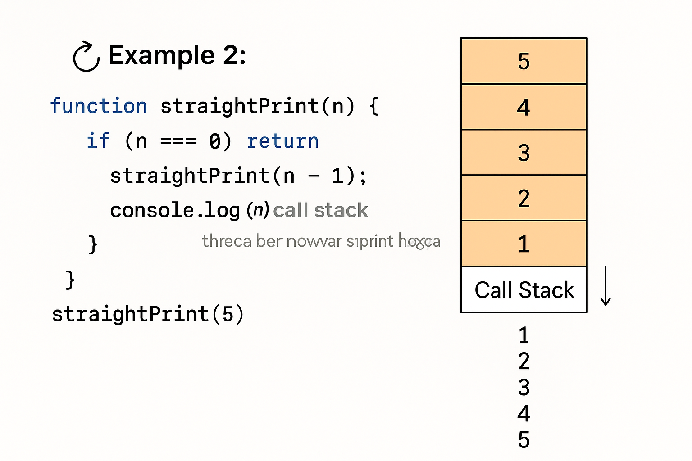

# 🔁 RecursionVerse – Mastering Recursion & Call Stack in JavaScript

**RecursionVerse** একটি beginner-friendly রিপোজিটরি, যেখানে JavaScript দিয়ে recursion এবং call stack এর কার্যপ্রণালী ব্যাখ্যা করা হয়েছে সহজ উদাহরণ ও কমেন্ট সহ।

---

## 📚 What You’ll Learn

- Recursion কী ও কেন ব্যবহার করা হয়
- Base case ও recursive case এর ব্যাখ্যা
- Factorial recursion
- Fibonacci sequence (loop ও recursion দুইভাবে)
- Stack memory (Call Stack) কিভাবে কাজ করে
- Execution context কীভাবে তৈরি হয়
- Practical flow visualization

---

## 📝 Files Overview

- `script.js`: Call Stack explained practically
- `recursion.js`: Recursion core logic explained
- Visuals: Supporting images

---

## 🖼️ Visual Diagrams

বুঝতে সুবিধার জন্য নিচের গ্রাফিকাল চিত্রগুলো যোগ করা হয়েছে:

### 🔄 Call Stack Visualization

### 🧠 Heap vs Stack Memory

### 🔢 One to N Recursion Flow

### 📊 Stack Work Flow

## ✨ Highlights

- **script.js** → এখানে call stack নিয়ে বাস্তব উদাহরণ আছে। প্রতিটি function call কীভাবে stack এ যায় এবং return হয়ে বের হয় তা বোঝানো হয়েছে।
- **recursion.js** → এখানে recursion নিয়ে step-by-step উদাহরণ আছে যেমন:
  - Basic recursive print
  - Factorial (with base case)
  - Fibonacci (loop & recursion)
  - Decrement and increment recursion
  - Output tracking for better understanding

---

## ✅ Prerequisites

- Basic understanding of JavaScript
- একটু ধৈর্য এবং মাথা ঠান্ডা রাখার মানসিকতা 😄

---

## 🧠 Why Learn Recursion?

> "If you truly want to understand how functions and memory work in JavaScript, recursion is your gateway." – **RecursionVerse**

---

## 🙋‍♂️ Author

Made with ❤️ by [Hamim Hossain](https://hamimibnhannan.netlify.app/)
📬 Feel free to reach out if you’re confused or want to contribute!

---

## 🏁 Final Note

এই রেপোটি তোমার JavaScript journey-তে recursion বুঝার ক্ষেত্রে সহায়ক হবে। ভালো করে পড়ে ফেলো, কোডগুলো নিজে হাতে লিখে দেখো — recursion তোমার বন্ধু হয়ে যাবে!
